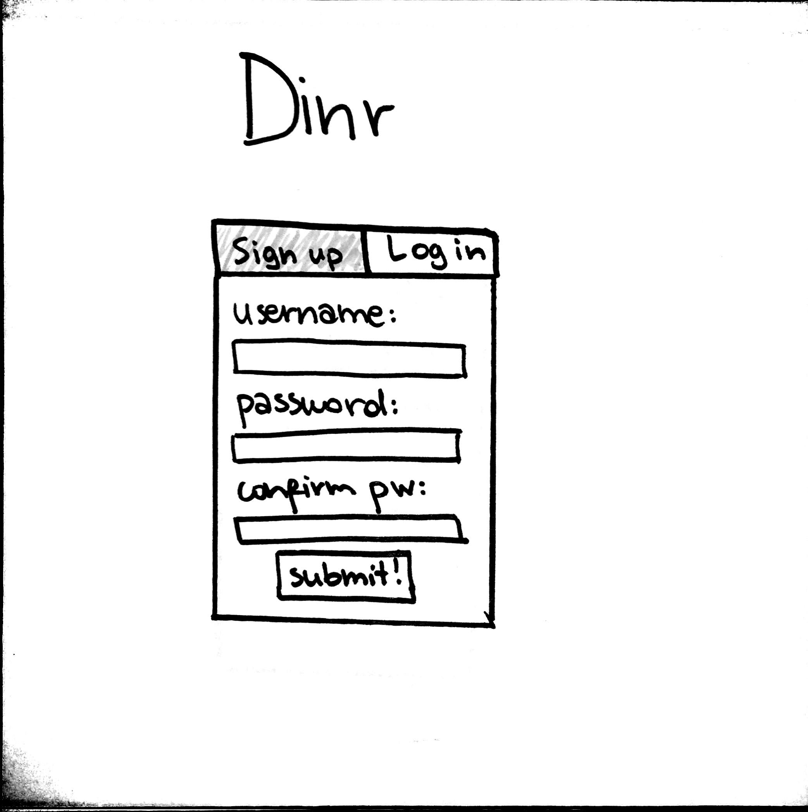

# Dinr

## Overview

You're vegan. Your best friend has celliac disease and she just started dating a guy who keeps kosher. How are y'all supposed to ever decide on a restaurant to get dinner? That's where Dinr comes in. 

Dinr is the millennial response to your friends' increasing dietary restrictions. It is a web app that allows users to look for personalized restaurant recommendations based on their (and their friends'!) dietary restrcitions. Once you create a profile and add all your restrictions, you can add your friends and create events. Then, based on the collective restrictions of the members participating in the event, Dinr will give you restaurant recommendations. So you don't starve to death while endlessly Yelping places.

## Data Model

The application will store Users, Events and Restaurants

* users can have multiple events (by embedding)
* users can have friends (other users) (via references)
* each event can have multiple users (members) (via references)
* each event can have multiple restaurants (via references)


An Example User with Embedded Events:

```javascript
{
  username: "olina",
  name: "Olina"
  dob: "10-29-1996"
  friends: // an array of references to other Users,
  events: // an array of references to Events the user is part of,
  restrictions: ['kosher']    // an array of dietary restrictions this user has
}
```

An Example Event:

```javascript
{
  name: "Dinner 11/3" // name of event
  restrictions: ['kosher', 'vegan'], // an array of dietary restrictions the event has
  users: // an array of references to Users,
  datetime: // Date object
  restaurants: // an array of references to Restaurants that satisfy the dietary restrictions of the Event
}
```

An Example Restaurant:
```javascript
{
  name: "Jajaja",
  image: https://s3-media1.fl.yelpcdn.com/bphoto/OgCU9NPFIl8hF_04Zani9w/o.jpg",
  id: "jajaja-new-york",
  rating: 4,
  stars: // html star representation of rating
  price: "$$",
  categories: [ "vegan", "mexican"],
  url: "https://www.yelp.com/biz/jajaja-new-york",
  address: "162 E Broadway New York, NY 10002",
  cuisine: "Vegan, Mexican"
}
```

## [Link to Commented First Draft Schema](/models/user.js) 


## Wireframes

/ - home page where you can sign up or log in (starts at log in tab)



/edit-profile - page where you edit your profile


/make-event - page where you can create an event


/user-profile/[your_username] - page where you can view your profile (includes your personal information, list of friends, and events)


/user-profile/[some_username] - page where [some_username] user's profile lives


/event/[name] - page where [name] event lives


/event/[name]/restaurants - page where the restaurant recommendations for [name] event live


## Site map


## User Stories or Use Cases

1. as non-registered user, I can register a new account with the site
2. as a user, I can log in to the site
3. as a user, I can fill out my profile and set my dietary restrictions
4. as a user, I can view my profile, including my friends and events
5. as a user, I can view other users' profiles and add them as friends
6. as a user, I can create an event
7. as a user, I can look at an event I'm in and generate restaurant recommendations for that event

## Research Topics

* (5 points) Integrate user authentication
  * I'm going to be using passport for user authentication
* (3 points) Use the Yelp Fusion API 
  * Using the Yelp Fusion API to get restaurant information 

8 points total out of 8 required points

## [Link to Initial Main Project File](app.js) 

## Annotations / References Used

1. [passport.js authentication docs](http://passportjs.org/docs) - (add link to source code that was based on this)
2. [Yelp Fusion API client for Node.js](https://github.com/tonybadguy/yelp-fusion) - (add link to source code that was based on this)
3. [MongoDB update operators reference](https://docs.mongodb.com/v3.2/reference/operator/update/)
4. [Implementation of passport using mongoose](https://github.com/saintedlama/passport-local-mongoose/tree/master/examples/login)
5. [Using Promises](https://stackoverflow.com/questions/38362231/how-to-use-promise-in-foreach-loop-of-array-to-populate-an-object)
6. [Hovering dropdown menu](https://www.w3schools.com/howto/howto_css_dropdown.asp)
7. [Dealing with authentication errors when logging in](https://github.com/jaredhanson/passport-local/issues/4)

[](https://ko-fi.com/Y8Y225QO7)
